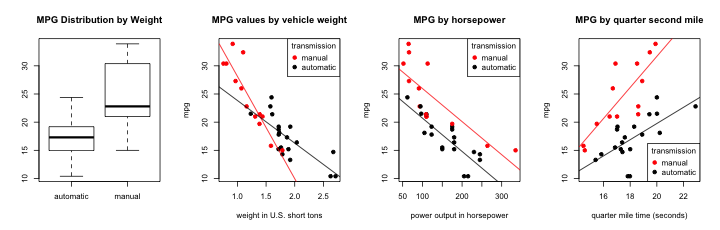
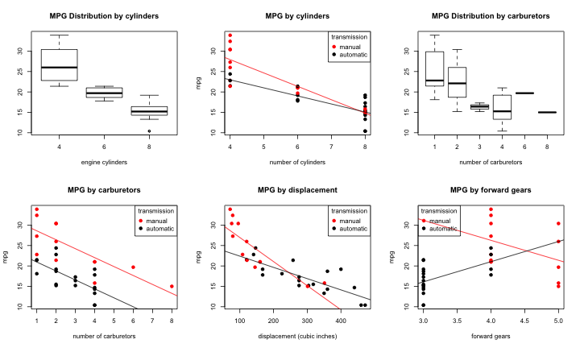

# Vehicle Fuel Economy Effect of Transmission Type
## Executive Summary
1. This analysis attempts to quantify the impact of selecting a manual or an automatic transmission on vehicle fuel economy, by reference to Road and Track Magazine's vehicle list from 1974. It attempts to mathematically model the characteristics determining fuel economy of existing cars and isolate the dependence on transmission type from other factors.  
* The model predicts an improvement of 2.9 miles per gallon from a manual transmission as compared with an automatic. However, the data do not compellingly support the reliability of the model.
* Recommendation: __Do not use the model's result__. Augment the dataset with paired manual and automatic transmission versions of the same make and model and repeat the analysis.

### <a name = "limitations" />Limitations and Notes on Analysis
* MPG may be correlated with other car features not included in the dataset and thus unavailable to the model, such as: tire type; cylinder configuration (inline or V); air, fuel, or exhaust system tuning; suspension type.  
* The analysis does not consider second order terms (interaction terms) or Principal Component Analysis (PCA).
* Consider repeating the analysis with a dataset pairing manual and automatic versions of the same make and model.

## Dataset
The dataset consists of 32 mass produced vehicles as featured in Road and Track magazine in 1974. For each of the vehicles, the dataset includes fields such as:
* mpg (miles per gallon)
* am (transmission type: automatic or manual)
* weight (multiples of 1,000 US pounds)

### Data Factorization
The analysis treats most data fields as numerical variables when performing regression, however note the following:
* The transmission type (manual or automatic) is a categorical variable.
* The number of engine cylinders is treated categorically; 4, 6, and 8 cylinder engines are the three categories. The underlying concept is that engines with differing cylinder counts may have significantly different configurations. 
* Carburetors are not treated categorically as direct mathematical comparison of different carburetor counts is feasible and meaningful.

### Observations from Data Exploration (see [Data Exploration](#exploration))
* The cars with manual vs automatic transmission are not identically distributed (see also [Additional MPG Plots](#additionalMpgPlots)). Note the corresponding regression lines.
* There may be a categorical difference between represented vehicles with manual and automatic transmission, making comparison difficult. For example, the price, interior configuration, and purpose of the vehicle (e.g. family vehicle, sports car) are not included in the dataset which could result in a biased conclusion (see also [Limitations](#limitations))

## Modeling the data
### Model selection strategy
* The analysis attempts to include only highly relevant predictors for outcome MPG, minimizing the number of predictors.
* It uses two different techniques for selecting variables for inclusion.
* Null hypothesis: None of the regressors predict vehicle fuel economy.
* We use two sided tests (such as student T-Tests) since outcome variance in either direction counts as evidence against the null hypothesis.

#### <a name = "model1" /> Model 1: Minimize Akaike Information Criterion (AIC)
The first is the built-in R function step() which through successive iterations drops fields from the model to __minimize__ the Akaike Information Criterion (AIC). Increasing the number of regressors raises the AIC; thus it attempts to balance fitting the data with minimizing regressor count, see: http://en.wikipedia.org/wiki/Akaike_information_criterion.

```r
model.all <- lm(mpg ~ factor(am) + factor(cyl) + disp + hp + drat + wt + qsec + gear + carb, mtcars)
model1 <- step(model.all)
```

#### <a name="summary">TABLE OF MPG VS MARGINAL CHANGE IN REGRESSOR VALUES WITH P-VALUES FOR MODEL 1

```
## lm(formula = mpg ~ factor(am) + wt + qsec, data = mtcars)
```

```
##                                   Estimate  Pr(>|t|)
## am: manual transmission              2.936 4.672e-02
## wt: per 1000 pounds weight          -3.917 6.953e-06
## qsec: per second of 1/4 mile time    1.226 2.162e-04
```
* All 3 predictors have a p-value below 0.05. However, the am factor (transmission type) p-value is barely below this threshold.
* The Adjusted __R squared value of 0.83__ suggests the model is a good fit.
* If the AIC report is credible, we reject the null hypothesis and include 3 predictors in the model, noting the marginal statistical significance for the transmission type factor. The model then predicts manual transmission increases fuel economy by approximately `round(summary1$coef[2, 1], 1)` MPG, assuming we make no other changes.

#### Model 2: P-Value stepwise backward selection
As described in the free online textbook Open Stats Intro http://www.openintro.org/stat Chapter 8, the analysis performs stepwise backward selection of highest p-values. The model initially includes all predictors and fits a regression line, calculating the p-value for each regressor for its relevance in the model. The method then eliminates the highest p-valued regressor from the model and refits. This iterative process continues until all predictors are below the significance threshold of 0.05.  

#### TABLE OF BACKWARD STEPWISE P-VALUE ITERATIONS FOR MODEL 2
```
model2 <- lm(mpg ~ factor(am) + factor(cyl) + disp + hp + drat + wt + qsec + gear + carb, mtcars)
model2 <- lm(mpg ~ factor(am) + disp + hp + drat + wt + qsec + gear + carb, mtcars)
model2 <- lm(mpg ~ factor(am) + disp + hp + drat + wt + qsec + gear, mtcars)
model2 <- lm(mpg ~ factor(am) + disp + hp + drat + wt + qsec, mtcars)
model2 <- lm(mpg ~ factor(am) + disp + hp + wt + qsec, mtcars)
model2 <- lm(mpg ~ factor(am) + hp + wt + qsec, mtcars)
model2 <- lm(mpg ~ factor(am) + wt + qsec, mtcars)
```
* The stepwise backward selection resulted in the same model as AIC.
* We provisionally accept the model as listed.

## Inspecting the Model

### Observations from Residual Plots (see [Residuals](#residuals))
* As with the exploratory plots, the residual plots raise troubling questions about the distribution of data between automatic and manual transmission equipped cars.  
* The distribution of residuals seems randomly distributed when viewed without regard to transmission type. Considering transmission type, the residuals are substantially clustered and are not identically distributed.

### Influence
#### TABLE OF INFLUENCE ON MODEL BY TRANSMISSION TYPE

```
##   transmission transmission dfbeta       wt     qsec
## 1    automatic             0.04002  0.06619 -0.03043
## 2       manual            -0.04722 -0.08428  0.04317
```
There is a notable difference between the influence of the transmission types.

### Treatment of outliers
The analysis includes all cars from the dataset. It does not exclude any outliers based on Cook's distance, influence measures(dfbetas function), etc.

# <a name = "results" />Results

* See [Table of Model 1](#summary).
* The __Adjusted R squared value of 0.83__ suggests the model is a good fit.
* The model predicts a __improvement to MPG of 2.94__ with a manual transmission.
* The decision of whether to accept the model result is more complicated; the p-value of the transmission regressor is barely below the 0.05 signifiance threshold. Furthermore, plots of both absolute values and residuals show that the manual and automatic transmission values are not identically distributed.
* On balance, the author believes it is more prudent to __draw no conclusion__ from the data with regard to the effect of manual or automatic transmission on vehicle fuel economy.
* Repeat the analysis when a dataset with paired manual and automatic transmission cars of the same make and model is available.

## Appendix A: Figures

### <a name="exploration">Figure A1: Data Exploration
 

### <a name="residuals">Figure A2: Model Residuals
 


### <a name = "additionalMpgPlots" />Figure A3: Data Exploration; additional MPG plots
 
